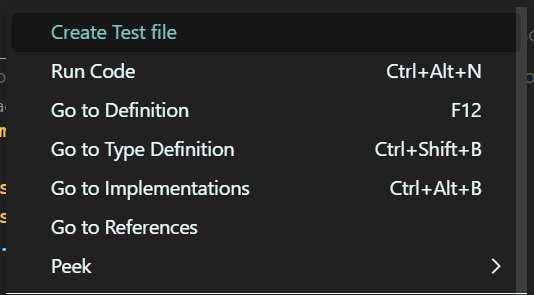

# Test file creator for Java and Scala

This simple plugin adds a command to create a test file for a Java or Scala file.

You can do this by right clicking on class name in the editor and selecting the option "Create Test File".

